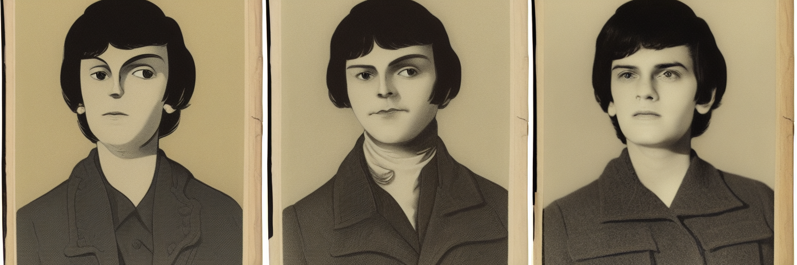

# Sprint 11 verification

Scope: issue #11, versioned character packages and consistency evaluation.
Implementation is local on `codex/sprint-11-characters`, based on `98737bc`.

## Red-green evidence

- `go test ./app -run TestCharacter -count=1` failed with `unknown field
  "character"` before production implementation. The tests express shared
  package/provenance resolution, selective draft invalidation and preservation
  of approved pins. Adding source references, strict package resolution and
  selected dependency fingerprints made them pass.
- `TestCharacterQueuedDraftAndStatusTrackChanges` then failed because changed
  dependencies were not visible and a stale queued job still succeeded.
  Current dependency status is now returned, and queued generation checks the
  package before backend submission. The test passes.
- `TestCharacterRejectsAmbiguousReferenceIDs` failed because duplicate artwork
  IDs were accepted. Resolution now rejects ambiguity in the selected set.
- `TestCharacterStrictPackage/numeric-version` failed because YAML coercion
  accepted a numeric version. Packages now require strict JSON types. Unknown
  fields, missing license metadata, unknown state IDs and escaping reference
  paths are also covered.
- Independent review found Go JSON decoding accepted case aliases such as
  `"version":"1","Version":"2"`. Four tests failed for top-level aliases,
  noncanonical description keys, nested state aliases and nested reference
  casing. Recursive exact-field validation now rejects them before decoding;
  the complete character suite passes. Evidence is retained in
  `red-review.log` and `green-review.log` under `bin/sprint11/`.

Additional checks cover reference-byte changes without a version bump, reference
version/path changes, and edits to an unselected costume. A CLI/real-stdio MCP
integration test confirms the character description reaches the renderer and
both interfaces expose resolved provenance and limitations.

## Checks

All passed in a local Go 1.27.1 Linux container: `go test -count=1 ./...`,
`go vet ./...`, `go test -race -count=1 ./...`, and CI-pinned golangci-lint
v2.14.0 (`0 issues`). Go changes were formatted with gofmt. Native Go remains
blocked by Windows application control; no new native Windows/macOS or hosted
CI result is claimed. Red/green and full-check logs are in ignored
`bin/sprint11/`.

## Real GPU evaluation

`TestCharacterRealBackendEvaluation` passed in 6.45 seconds against the user's
local ComfyUI server, generating and explicitly selecting three images before
building the 1536 x 512 strip. Each image is 512 x 512 RGB at seed 17, 20 Euler
steps, CFG 7, normal scheduler. The fixture varies front/three-quarter/side pose
descriptions while keeping identity and costume shared.

- GPU: RTX 4090, 24,564 MiB reported by nvidia-smi during Sprint 10 setup.
- Backend: ComfyUI `8cfe5e1ecb97512dea8deaac15e1228d7e6feeb1`; same local
  container/profile as the recorded Sprint 10 smoke run.
- Checkpoint: `v1-5-pruned-emaonly.safetensors`, SHA-256
  `6ce0161689b3853acaa03779ec93eafe75a02f4ced659bee03f50797806fa2fa`.
- Profile hash: `241eb9ee21e62da5a91c407ac9b84c5d495018fa11073ee5724740436fd0125a`.
- [Frozen recipes](assets/11-character-recipes.json) retain effective prompts,
  workflow, package states, reference/license metadata and hashes for all panels.
- [Generated strip](assets/11-character-evaluation.png), ordered front, turn,
  side, is retained with this report. Full local job records and the selected
  project remain in `bin/sprint11/evaluation/`.

Using the [manual rubric](../characters.md), 0 means absent/wrong, 1 means
partial/uncertain, and 2 means matches. Scores below describe this single run.

| Dimension | Front | Turn | Side | Observation |
| --- | --- | --- | --- | --- |
| Identity | 1 | 1 | 1 | Dark hair recurs, but fringe, facial proportions and rendering style drift; reference identity is not established. |
| Costume/palette | 0 | 0 | 0 | Sepia/dark clothing replaces the orange/navy palette; lower garments are cropped and cannot be assessed. |
| Expression/pose | 1 | 1 | 1 | Expressions are broadly neutral, but the requested view changes are weak; the side panel is not a side profile. |
| Prop fidelity | 0 | 0 | 0 | No visible lantern in any panel. |
| Composition | 1 | 1 | 1 | One person fits each frame, but all are cropped bust portraits despite the full-body request. |

This is a successful transport/composition test and an unsuccessful demonstration
of reliable design fidelity. The same seed does not prove consistent identity.
The adapter advertises description conditioning only; reference artwork is not
fed to SD 1.5. No stronger identity, exact-prop or pose-control claim is made.
The example references are CC0 geometric demo assets with their notice; the
generated strip is a model-output evaluation artifact, not a new CC0 reference.

## Limits and publication

Package/reference identities are operator-supplied metadata plus local content
hashes. No license permission engine, training, automatic scoring, image-reference
conditioning or matting was added. Package checks at execution/selection do not
interrupt already-running work. Existing approval/manual override/lock and
project revision gates remain in force. Only selected dependencies are included;
unselected valid state edits do not invalidate drafts.

No changes have been pushed, no PR/release/tag published, and issue #11 remains
open pending publication and hosted checks.

Independent review used `.agents/skills/paneltree-code-review/SKILL.md` and
inspected the complete diff, requirements, red-green evidence, fixtures, frozen
recipes, and generated image. Its one P2 finding about case-ambiguous JSON keys
was corrected with failing tests first. Re-review found no actionable issues.
