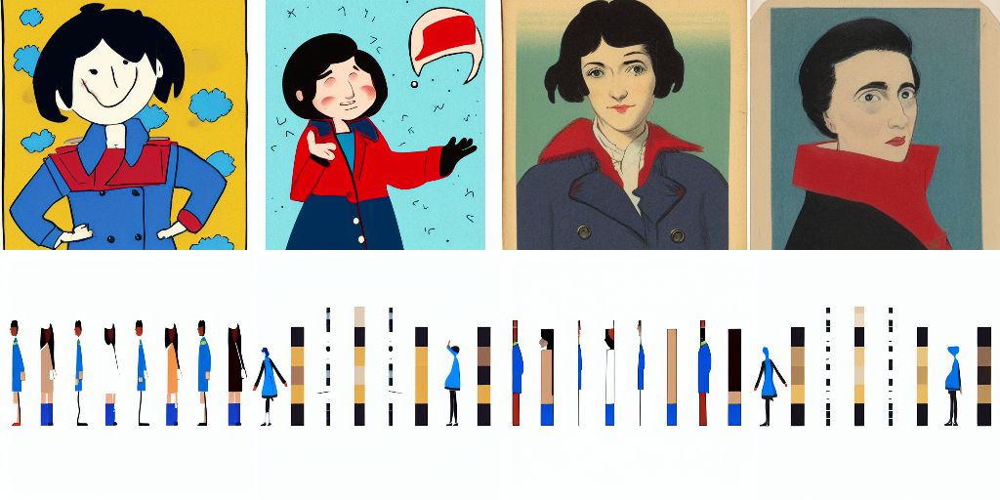

# Issue 22 — approved character references

## Implementation and red–green evidence

Branch: `codex/character-reference-workflow`, based on main after #23.

Behavioral failures observed before the corresponding implementation/fix:

| Focused test | Observed red | Green behavior |
| --- | --- | --- |
| `TestRejectUnconsumedReferencePixels` | reference pixels silently discarded by text-only profile | incompatible profiles reject the request |
| `TestReferenceApprovalAndPublication` | reference workflow unavailable (API scaffold) | explicit approval, eight originals, atomic four-card publication, immutable published versions, descendant invalidation |
| `TestReferenceGenerationExplicitAcceptance` | unknown reference action `request` | existing durable jobs, idempotent submission, collect without auto-approval |
| `TestReferenceCLI`, `TestReferenceMCP` | unknown flag / unknown tool | both use the same application service |
| `TestPanelRejectsMissingPublishedReferences` | missing references silently replaced with text | missing publication fails before submission |
| `TestImageBindingMustReachOutput` | disconnected image accepted; subsequently mask-only path accepted | IMAGE socket must reach output; mask-only path rejected |
| repeated import in lifecycle test | approved front lost its lineage after import retry | approved-import retry preserves approval |
| `TestRejectedImportCanBeRetried` | rejected image could not be reimported | explicit new import attempt preserves rejected history |

Additional checks exercise exact multipart PNG bytes/hash/path, frozen input
detachment, two panels sharing one published set without regenerating references,
stale completion followed by explicit reapproval, original-parent retention and
cancelled-job rejection. Existing tests continue covering editorial pins, scoped
locks, job cancellation, durable retries and selected-character invalidation.

## Real backend evaluation

Opt-in `TestRealReferenceEvaluation` completed locally on 2026-09-30 in 21.46s.
It is skipped in ordinary CI. It generated seven derived-view candidates and
eight panel comparisons (two prompts × seeds 17/42 × text/image conditioning).
All jobs succeeded, with actual multipart reference uploads and frozen recipes.
This is **transport/lifecycle verification, not a perceptual acceptance pass**.

Inputs are a deliberately simple, authored CC0 geometric character: black hair,
blue coat, red patch on the anatomical left sleeve, and a red left-cheek mark.
Eight body/head views were explicitly imported and accepted by the evaluation
fixture, then published. These approvals concern this test fixture only; no user
story character was approved. Side drawings are separate fixtures, not mirrors.

The checked-in [artifacts](assets/22-reference-evaluation) contain all eight
originals, the accepted manifest, seven generated view candidates, eight panel
outputs, and exact request/recipe JSON including uploaded reference bytes.
Generated derived views remain unapproved. The panel test reuses the published
fixture without regenerating it. Character metadata matches the blue-coat design.

Backend: ComfyUI `8cfe5e1ecb97512dea8deaac15e1228d7e6feeb1`; Docker image
`sha256:a63bf18f31c7ac7d7748d79a628dd661fb440371ab7e97127aead2e5475e62d8`;
RTX 4090 24 GiB. SD 1.5 checkpoint SHA-256:
`6ce0161689b3853acaa03779ec93eafe75a02f4ced659bee03f50797806fa2fa`.
Euler, normal scheduler, 20 steps, CFG 7; text baseline denoise 1, img2img 0.65.
Panels and derived outputs are 512×512. Profiles and hashes appear in each recipe.



Columns: wave seed 17, wave seed 42, portrait seed 17, portrait seed 42.

| Manual criterion | Text-only | Image-conditioned |
| --- | --- | --- |
| Identity | Faces and drawing style vary markedly | Fixture silhouettes persist, but there is no usable single-character panel |
| Asymmetric features | Left sleeve patch not reliably followed | The supplied left-body candidate remained front-facing and changed the patch color; anatomical placement unreliable |
| Costume | Blue/red placement changes, especially across seeds | Blue/black fixture structure retained more strongly, at the cost of copying its composition |
| Pose/expression | Some prompt response, inconsistent framing and expression | Layout dominates; turning/waving/expressive portrait largely fails |
| Scene fit | Individual portrait/figure compositions, little dependable park context | Repeated reference-sheet figures on white background; unsuitable story scene |

Conclusion: real conditioning works mechanically, but this core-node SD 1.5
img2img profile does **not** establish usable character consistency. It treats a
multi-view sheet as a composition to preserve. Do not approve these generated
views or use this evaluation as a claim that reference-aware identity generation
is solved. A stronger reference-aware model/adapter profile needs its own visual
evaluation. The generic ordered image-input contract supports such workflows
without embedding vendor nodes in story YAML, but none is claimed verified here.

Reproduce against a matching configured local backend:

```sh
PANELTREE_REFERENCE_EVAL_URL=http://host.docker.internal:8188 \
PANELTREE_REFERENCE_EVAL_OUTPUT=/workspace/bin/issue22/evaluation \
go test ./app -run TestRealReferenceEvaluation -count=1 -timeout=20m -v
```

The test adapts the text profile's model identity/filename to the checked-in image
profile. Update the latter for a different installation. It writes only to its
temporary test project, the chosen output directory, and scoped ComfyUI uploads/
generated outputs. The fixture manifest's accepted IDs resolve against the PNG
hashes, not the temporary machine paths in captured requests.

## Checks and review

Native Windows Go execution is blocked by application control. Required checks
run through the existing Docker Go 1.27.1 toolchain and cached CI-pinned
golangci-lint 2.14.0. Final checks passed: `gofmt`, `go test ./...`,
`go vet ./...`, `golangci-lint run` (zero issues), and `go test -race ./...`.
Independent review and substantive-fix re-review completed with no remaining
actionable findings. The reviewer also identified the original fixture's frontal
side silhouettes; those were corrected and the real evaluation rerun before the
results above were recorded. Renderer dimension-capability reporting also has
red–green coverage (missing limit reproduced, 8192px limit exposed).

These are local Linux-container results. Native Windows and hosted CI checks
remain unverified. Changes are uncommitted/unpushed; the issue remains open.
Usable visual consistency is not established by the current SD 1.5 profile.

